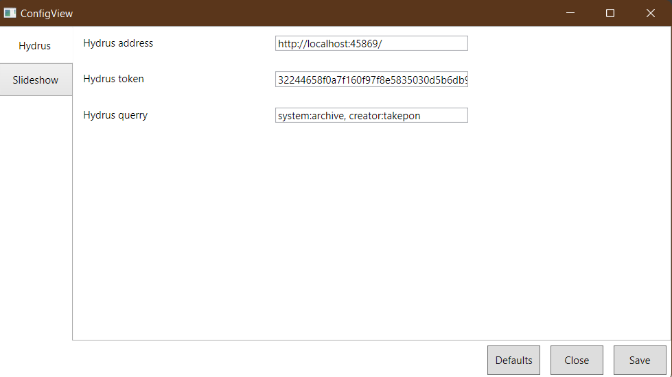
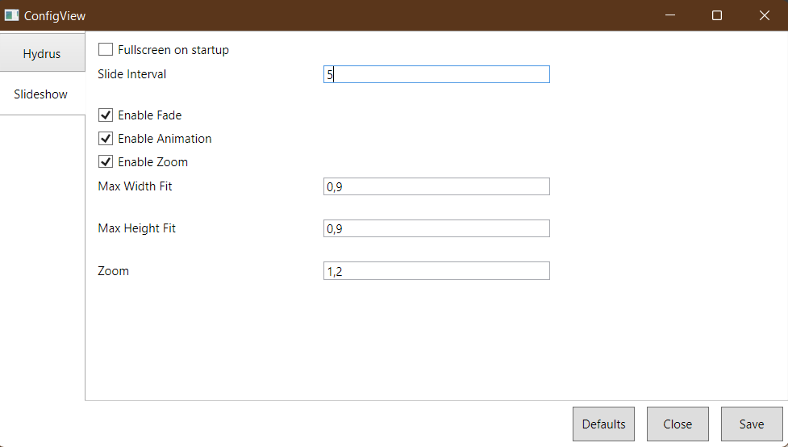

# Hydrus Slideshow
Hydrus Slideshow is a simple Kodi-like slideshow app that can be used as screensaver.

# Configuration
Use `/c` command line argument or `Alt + C` shortcut to open config window.

Setup your Hydrus instance in 'Hydrus' tab

Setup slideshow preferences in 'Slideshow' tab

# Shortcuts

|Action    |Shortcut|
|----------|--------|
|Play/Pause|`Space` |
|Next Image|`Right` |
|Previous Image|`Left` |
|Send Image to Hydrus 'Hydrus Slideshow' tab|`Ctrl + S`|
|Copy Image hash to clipboard|`Ctrl + C`|
|Open Config|`Alt + C`|
|Toggle Fullscreen|`Alt + Enter`|
|Toggle Help|`F1`|

# Using app as a screensaver

  - Rename executable `.exe` -> `.scr`
  - Open new file with `RMB`
  - Press 'Install'